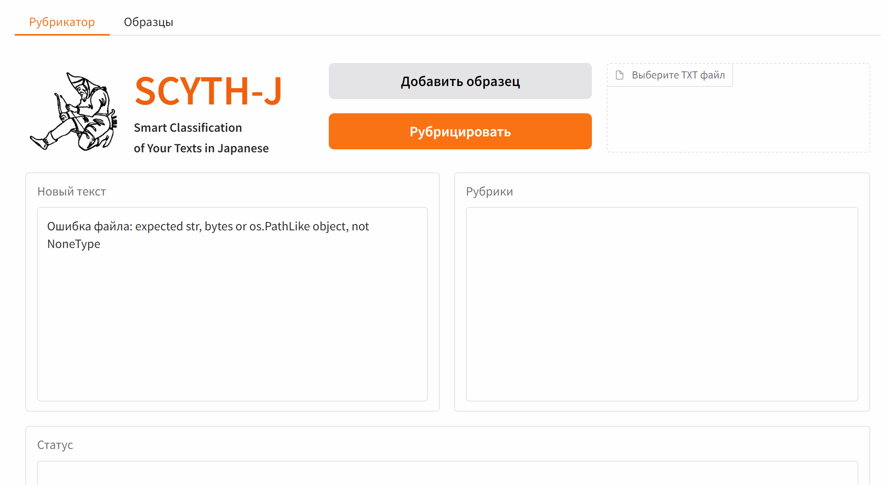

# SCYTH-J: Smart Classification of Your Texts in Japanese


# Проект на Python

[](LICENSE)

**SCYTH-J** — это веб-приложение на основе нейронных сетей для классификации японских текстов в заданные категории. Проект использует квантовый моделирование и методы обработки естественного языка для анализа и рубрицирования текстов.

---

## 📌 Описание
SCYTH-J позволяет:
- Анализировать японский текст и определять его тематику.
- Сравнивать тексты с эталонными векторами категорий.
- Добавлять/удалять эталонные образцы.

  

---

## 🚀 Установка

### **Требования**
- Python 3.11.9
- Виртуальное окружение (`venv`)
- 3.2+ ГБ свободного места (для модели)

### **Инструкция по установке**

1. **Склонируйте репозиторий**:
   ```bash
   git clone https://github.com/jhgudleik/scyth_j.git
   cd scyth-j
   ```

2. **Создайте и активируйте виртуальное окружение**:
   ```bash
   python -m venv scyth_j_venv
   ```
   - **Windows**:
     ```batch
     scyth_j_venv\Scripts\activate
     ```
   - **Linux/Mac**:
     ```bash
     source scyth_j_venv/bin/activate
     ```

3. **Установите зависимости** (автоматически загрузит `requirements.txt`):
   ```bash
   pip install -r requirements.txt
   ```

4. **Скачайте модель**.
По адресу:   https://huggingface.co/Cyrilos/scyth_5_cpu_int8/
5. **Запустите приложение**:
   ```bash
   python app.py
   ```
   Приложение откроется в браузере по адресу `http://127.0.0.1:port`.

6. **Используйте .bat файл**:
Дважды щелкните по init.bat. При первом запуске скачается модель, будут установленны зависимости и запустится приложение в окне браузера.
При последующи запусках будет приложение так же будет открываться в окне браузера.


---

## 📂 Структура проекта

```

scyth-j/
│
├── app.gif                  # Демо
├── init.bat                 # Установка зависимостей, скачивание модели и запуск приложения
├── scyth.png                # Логотип приложения
├── standard/                # Каталог эталонных данных
│   ├── vectors.txt          # Список векторов категорий
│   ├── topics.txt           # Карта ID → тема
│   ├── 1.vec, 2.vec, ...    # Вековые файлы категорий
│   └── 1.txt, 2.txt, ...    # Примеры текстов
│
├── requirements.txt         # Зависимости (pip)
├── scyth_5_cpu_int8.pth     # Квантовая модель (автоматически скачивается)
├── app.py                   # Основной скрипт приложения
├── download_model.py        # Скачивание модели
├── README.md                # Этот файл
└── LICENSE                  # Лицензия проекта
```

---

## 🛠 Использование

### **Вкладка "Рубрикатор"**
1. Введите японский текст в поле `Новый текст` или выберите файл.
2. Нажмите кнопку **Рубрицировать**.
3. Приложение выведет список найденных категорий с вероятностью совпадения.
   
### **Добавление нового образца**
1. Нажмите **Добавить образец**.
2. Выберите категорию или введите пользовательскую.
3. Нажмите **Сохранить**.
4. Образец добавляется в базу и становится доступен для последующего анализа.
   
### **Управление категориями**
- Вкладка **Образцы** позволяет:
  - Сортировать по имени или теме.
  - Удалять ненужные образцы.

---

## 🔧 Настройки

Параметры модели и поиска задаются в начале файла `app.py`. Ключевые параметры:
| Параметр               | Описание                                                                 |
|------------------------|---------------------------------------------------------------------------|
| `TOP_K`                | Количество возвращаемых категорий (по умолчанию — `3`).               |
| `COSINE_THRESHOLD`     | Порог косинусного сходства (0.975 — рекомендуется для точности).     |
| `USE_FBGEMM`           | Использовать оптимизированный бекэнд для ускорения вычислений.         |

---

## 🔄 Скачивание модели
Модель `scyth_5_cpu_int8.pth` скачивается автоматически при первом запуске init.bat из репозитория Hugging Face:
```bash
repo_id="Cyrilos/scyth_5_cpu_int8"
```
Если скачивание не работает, убедитесь, что:
- Подключение к интернету стабильное.
- У вас есть доступ к Hugging Face Hub.

---

## 🛡 Лицензия

Проект распространяется под лицензией **MIT**. См. файл `LICENSE` для деталей.

---
## 📢 Контакты
- **Автор**: [Cyrilos](https://huggingface.co/Cyrilos)
- **Почта**: 📧 [jhgudleik@gmail.com]
- **GitHub**: [scyth-j-repo-link](https://github.com/jhgudleik/scyth_j)
- **Вопросы**: Открывайте `Issues` в репозитории.
---
tags:
  - [nlp](https://github.com/topics/nlp)
  - [japanese](https://github.com/topics/japanese)
  - [multilabel](https://github.com/topics/multilabel-classification)
  - [pytorch](https://github.com/topics/pytorch)
  - [quantization](https://github.com/topics/quantization)
  - [cpu](https://github.com/topics/cpu)
  - [semantic-search](https://github.com/topics/semantic-search)
  - [wikipedia](https://github.com/topics/wikipedia)
  - [knowledge-graph](https://github.com/topics/knowledge-graph)
  - [embedding](https://github.com/topics/embedding)
---
© 2024 SCYTH-J. Все права защищены.
